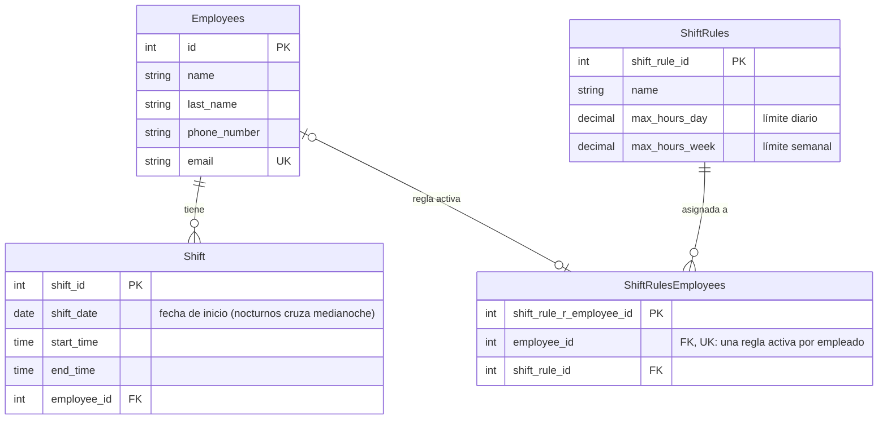
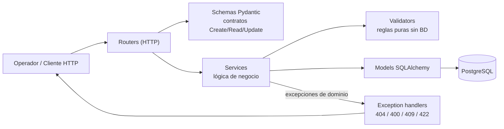
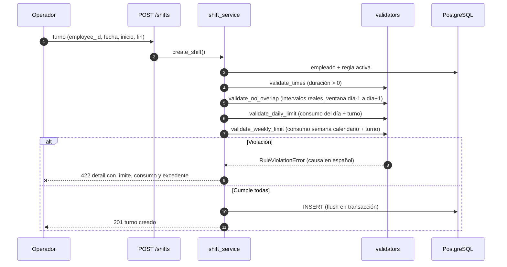

# Modelo de Negocio — Gestión de Turnos Laborales

> Documento de dominio: lenguaje ubicuo, reglas de negocio, modelo de datos,
> arquitectura y requisitos del producto. Complementa el `README.md` (setup y
> uso).

---

## 1. Lenguaje ubicuo

Vocabulario común entre el negocio y el código. Cada término tiene un
correspondiente exacto en la implementación.

| Término | Definición | En el código |
|---|---|---|
| **Empleado** | Persona que trabaja turnos; sus horas se planifican y controlan | `Employee` / tabla `employees` |
| **Turno** | Bloque de trabajo con fecha, hora de inicio y hora de fin | `Shift` / tabla `shifts` |
| **Turno nocturno** | Turno cuya hora de fin es menor a la de inicio: cruza la medianoche | `validators.is_overnight` |
| **Regla laboral** | Límites máximos de horas diarias y semanales de un empleado | `ShiftRule` / tabla `shift_rules` |
| **Asignación de regla** | Relación activa entre un empleado y una regla (una por empleado) | `ShiftRuleEmployee` / tabla `shift_rules_employees` |
| **Jornada Completa** | Regla con máximo 8 h/día y 40 h/semana | dato sembrado (`seed.py`) |
| **Media Jornada / Part-time** | Regla con máximo 5 h/día y 20 h/semana | dato sembrado (`seed.py`) |
| **Semana calendario** | Ventana de lunes 00:00 a domingo 24:00 usada para el límite semanal | `validators.week_bounds` |
| **Límite diario** | Máximo de horas acumuladas del empleado el día de inicio del turno | `ShiftRule.max_hours_day` |
| **Límite semanal** | Máximo de horas acumuladas del empleado en una semana calendario | `ShiftRule.max_hours_week` |
| **Traslape** | Dos turnos del mismo empleado cuyos intervalos reales se intersectan | `validators.validate_no_overlap` |
| **Excedente** | Horas en que un turno propuesto superaría un límite existente | mensajes de rechazo |
| **Carga masiva** | Envío de varios turnos en un solo request, all-or-nothing | `POST /shifts/bulk` |
| **Reporte** | Consolidado del empleado: perfil, regla, métricas y turnos | `GET /employees/{id}/report` |
| **Operador** | Usuario del sistema que crea recursos y asigna turnos | consumidor de la API |
| **Rechazo con causa** | Rechazo HTTP 422 explicando límite, consumo actual y excedente | `RuleViolationError` |

---

## 2. Reglas de negocio

| ID | Regla | Comportamiento |
|---|---|---|
| **BR-01** | Límite diario: la suma de horas del empleado el día de inicio del turno + el turno nuevo ≤ `max_hours_day` | 422 con causa detallada |
| **BR-02** | Límite semanal: idéntico al BR-01 sobre la **semana calendario (lunes a domingo)** de la fecha de inicio | 422 con rango de la semana |
| **BR-03** | Duración del turno mayor a cero (`end_time ≠ start_time`) | 422 |
| **BR-04** | Turno nocturno: si `end_time < start_time`, cruza la medianoche (ej. 22:00→06:00 = 8 h). Sus horas se atribuyen al **día de inicio** para BR-01 y BR-02 | soportado |
| **BR-05** | Sin traslapes para el mismo empleado, comparando el **intervalo datetime real** (un nocturno conflicta con turnos del día siguiente) — decisión adoptada: rechazo, no sobrescritura | 422 con intervalos |
| **BR-06** | El empleado debe tener una regla laboral asignada antes de programar turnos | 422 con instrucción |
| **BR-07** | Una regla activa por empleado (única `employee_id` en la unión, al nivel de BD) | 409 si duplicada |
| **BR-08** | Carga masiva all-or-nothing: si cualquier ítem viola una regla, nada se persiste; respuesta lista errores por índice | 422 + detalles por ítem |
| **BR-09** | Integridad operacional: no eliminar un empleado con turnos, ni una regla con asignaciones | 409 |
| **BR-10** | Las horas se calculan con aritmética `Decimal` exacta; sin redondeos flotantes | interna (`Numeric(4,2)`) |

### Ejemplos de rechazo

Límite diario excedido (turno individual):

```json
{
  "detail": "El empleado 1 excede el límite diario de 8h del 2026-09-08: ya tiene 8h asignadas y el turno aporta 0.5h (excedente: 0.5h)"
}
```

Sobre traslapes (BR-05) la decisión adoptada — a criterio del candidato según
lo conversado con el planteador — es **rechazar con causa**: sobrescribir
turnos silenciosamente puede destruir asignaciones existentes sin aviso del
operador.

Carga masiva con un ítem inválido (BR-08, all-or-nothing):

```json
{
  "detail": [
    { "index": 1, "employee_id": 2, "shift_date": "2026-09-11",
      "causa": "El empleado 2 excede el límite diario de 8h del 2026-09-11: ya tiene 0h asignadas y el turno aporta 9h (excedente: 1h)" }
  ]
}
```

Los límites se respetan también **entre turnos del mismo lote**: cada ítem
validado se hace visible para el siguiente dentro de la transacción.

---

## 3. Modelo de datos



Clave de lectura: *un empleado tiene cero o más turnos; tiene cero o una
asignación de regla; una regla puede estar asignada a muchos empleados; la
asignación pertenece exactamente a un empleado y a una regla.*

El esquema físico lo genera y evoluciona Alembic (`alembic/versions/`).

---

## 4. Arquitectura

### Vista general



### Flujo del filtro inteligente (validación de un turno)



En `/shifts/bulk` los pasos 2–4 se repiten por ítem: cada turno validado se
hace visible para el siguiente dentro de la misma transacción, y ante el
primer error acumulado se revierte todo el lote (BR-08).

---

## 5. Requisitos funcionales

| ID | Requisito | Estado |
|---|---|---|
| **RF-01** | CRUD de empleados con paginación y filtros (nombre parcial, email exacto) | ✅ |
| **RF-02** | CRUD de reglas laborales con validación de coherencia (semana ≥ día, límites > 0) | ✅ |
| **RF-03** | Asignación de una regla activa a cada empleado, con reemplazo y baja | ✅ |
| **RF-04** | CRUD de turnos bajo el filtro inteligente: BR-01 a BR-06 | ✅ |
| **RF-05** | Carga masiva `/shifts/bulk` all-or-nothing con errores por índice | ✅ |
| **RF-06** | Reporte por empleado: perfil, regla aplicada, métricas día/semana vs. límites y turnos filtrables | ✅ |
| **RF-07** | Toda violación se rechaza informando la causa en español (límite, consumo, excedente) | ✅ |
| **RF-08** | Soporte de turnos que cruzan la medianoche (confirmado por el planteador) | ✅ |
| **RF-09** | Listado de turnos filtrable por empleado y rango de fechas | ✅ |
| **RF-10** | Documentación OpenAPI con descripciones en español de todos los endpoints | ✅ |

---

## 6. Requisitos no funcionales

| ID | Requisito | Cómo se cumple |
|---|---|---|
| **RNF-01** | Exactitud aritmética en límites de horas | `NUMERIC` + aritmética `Decimal` de punta a punta; sin `float` en decisiones de negocio |
| **RNF-02** | Testabilidad | Validadores puros sin BD; 97 tests unitarios + integración; 99% de cobertura en la capa de dominio |
| **RNF-03** | Aislamiento de datos en tests | Patrón transaccional: cada test corre en una transacción que se revierte; BD dedicada `turnos_test` |
| **RNF-04** | Reproducibilidad del entorno | `requirements.txt` congelado, Docker + compose, volúmenes e init-scripts |
| **RNF-05** | Portabilidad de motor de BD | Modelos con tipos abstractos; dependencia del distribuidor aislada en `DATABASE_URL` + driver |
| **RNF-06** | Usabilidad de la API | OpenAPI con resúmenes en español (24/24), errores con causa accionable, códigos HTTP con semántica correcta |
| **RNF-07** | Seguridad de secretos | Ninguna credencial en el repo: `.env` gitignoreado, `.env.example` con placeholders, `${VAR}` en compose |
| **RNF-08** | Calidad estática | ruff (0 violaciones) + mypy (0 errores en 33 archivos); flujo unificado `make qa` |
| **RNF-09** | Rendimiento de consultas | Índice compuesto `ix_shifts_employee_shift_date` alineado con el patrón de consulta de los validadores |
| **RNF-10** | Arranque reproducible | Migración automática al arrancar el contenedor; demo end-to-end con `make demo` |

---

## 7. Tecnologías por utilidad

### Construcción de la API
| Tecnología | Utilidad |
|---|---|
| **Python 3.12** | Lenguaje base del proyecto |
| **FastAPI** | Framework HTTP: registro de rutas, DI (`Depends`), OpenAPI automática |
| **Pydantic v2** | Contratos de entrada/salida (schemas), validación y errores 422 estructurados |
| **pydantic-settings** | Configuración tipada desde variables de entorno / `.env` (fail fast) |
| **uvicorn** | Servidor ASGI de desarrollo con hot-reload |

### Persistencia
| Tecnología | Utilidad |
|---|---|
| **SQLAlchemy 2.0** | ORM: modelos tipados (`Mapped`), relaciones, dialectos portables |
| **psycopg3** | Driver contra PostgreSQL (wheels binarios, sin compilación) |
| **Alembic** | Migraciones versionadas del esquema (upgrade / downgrade) |
| **PostgreSQL 16** | Base de datos: tipos reales (`DATE`, `TIME`, `NUMERIC`), constraints, transacciones DDL |

### Calidad y testing
| Tecnología | Utilidad |
|---|---|
| **pytest** | Framework de tests (unitarios + integración) |
| **httpx** | `TestClient` para verificación de endpoints de punta a punta |
| **pytest-cov** | Medición de cobertura (objetivo ≥ 85%, logrado 99%) |
| **ruff** | Linter de calidad estática (0 violaciones) |
| **mypy** | Type checker estático (0 errores), con plugin de Pydantic |
| **Makefile** | Unificación del flujo: `lint`, `types`, `test`, `qa`, `demo` |

### Infraestructura
| Tecnología | Utilidad |
|---|---|
| **Docker** | Empaquetado de la API y de la base de datos |
| **docker-compose** | Orquestación local: `db`, `api`, `adminer`; migración automática al arrancar |
| **Adminer** | Inspección visual de la base de datos (tooling de desarrollo) |

### Distribución de dependencias
| Archivo | Contenido |
|---|---|
| `requirements.txt` | Runtime de la aplicación (lo único que la imagen Docker instala) |
| `requirements-dev.txt` | Herramientas de calidad (ruff, mypy): solo en el entorno del desarrollador |
